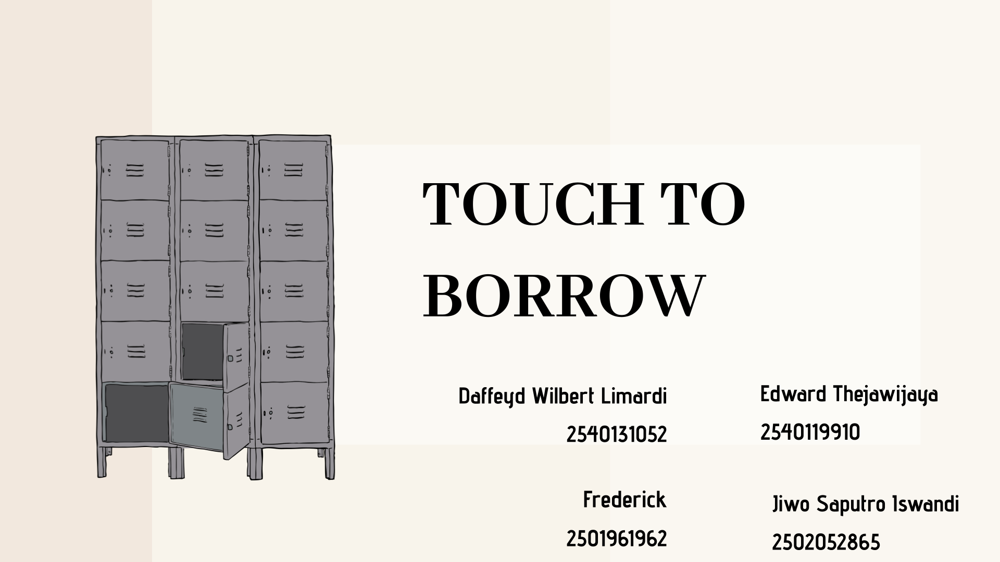
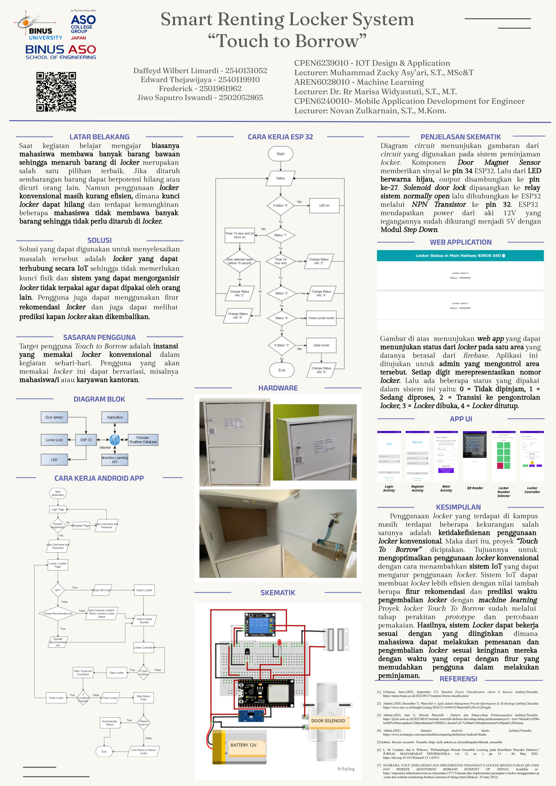

# Smart Locker System with IoT for University (Touch to Borrow)
Entering 2023 BINUS ASO School of Engineering is switch into fully onsite activity, as BINUS ASO is provide a bunch of locker. But, the number of locker is far lower than the number of students, other than that the locker borrowing system was very complicated and takes a long time to complete. In order to solve the problem my team create a locker system that have a very short borrowing process and improve the effectiveness the system. Locker renting system has a recommendation system and returning time prediction with machine learning based on their history.

---

### Table of Contents

- [Description](#description)
- [Documentation](#documentation)
- [Author Info](#author-info)

---

## Description

This project is using the ESP32. This project outcome is to make locker that can be accessed by student using their smartphones. They can also access a real time status of locker

#### Technologies

- Cloud API deployment using FAST API framework  
- API. firebase API and FAST API
- Web APP. This project use HTML, JS, CSS, and bootstrap to build.
- Databases. This project use FIREBASE DBMS noSQL databases.
  
[Back To The Top](#Smart-Locker-System-with-IoT-for-University-(Touch-to-Borrow))

---

## Documentation

[Demo Video](https://drive.google.com/file/d/1HcFfmzMOpPdhUpCI1-zlelSOwKXpTc5F/view?usp=sharing)
[Presentation Video](https://drive.google.com/file/d/1wt5NSbx41HVJX6qqzyZHxCqV4PNmFrW4/view?usp=sharing)

[Back To The Top](#Smart-Locker-System-with-IoT-for-University-(Touch-to-Borrow))

---
## Author Info

- Instagram - [daffeydwilbert](https://www.instagram.com/daffeydwilbert/)
- Email - daffeydwilbert@gmail.com

[Back To The Top](#Smart-Locker-System-with-IoT-for-University-(Touch-to-Borrow))
